Bridge top (AHB2APB Bridge) block diagram and functionality:

  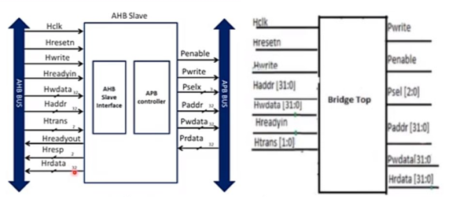

The AHB2APB bridge provides a connection between the Advanced High-Performance Bus (AHB) and Advanced Peripheral Bus (APB) in a system-on-chip (SoC) design. The bridge facilitates communication and coordination between the two bus protocols which are AHB and APB,enabling seamless data transfer and control. 

Bridge top module is a AHB slave which comprises of submodules called AHB slave interface and APB controller 
The functionalities of the AHB2APB bridge can be summarized with the following bullet points:
1. Bridge top involves in the translation of data of the AHB bus protocol used by high performance modules like CPU, DMA and on chip memories into the APB bus protocol used by low power peripherals like UART, keypad…
2. The bridge performs address mapping between the AHB address space and the APB address space. It translates AHB addresses to appropriate APB addresses, ensuring that the correct peripherals are selected and accessed.
3. The bridge handles data transfer between the AHB and APB buses. It manages read and write operations b/w bus protocols, passing data and control signals between the modules and peripherals.

AHB Master:

  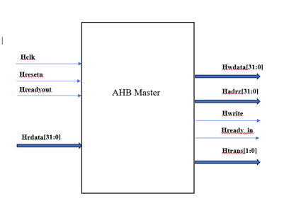

1. AHB Master is the module which can access the bus in the protocol to perform read/write data transfer and communication between the modules, The master can be a CPU, DMA (Direct Memory Access) controller, or any other IP core that requires access to the system's resources.
2. It generates calculated address based on the type of transfer like single, burst etc and control signals for the transaction to be happened in return specifies which slave to be selected
3. In a multi-master system, where there are multiple AHB masters, the bus arbitration logic determines which master gets access to the bus when multiple masters request it simultaneously. The AHB master participates in the arbitration process to acquire the bus when it needs to perform a transaction.
4. The AHB master transfers data to or from the specified slave device or memory location. It handles the data transfer protocol and timing requirements specified by the AHB protocol.

APB Interface:

  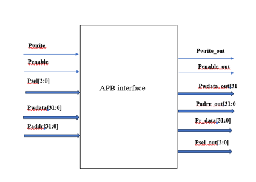

1. The APB (Advanced Peripheral Bus) is another bus protocol defined by ARM that is commonly used for connecting peripheral devices to the AHB bus in an SoC.
2. It transfers the data that is obtained from the bridge to the selected slave which is connected to the APB bus
3. Generates and transfers the data that is to be read by the AHB master from the selected slave based on the control signals.

Submodules

AHB slave interface:

  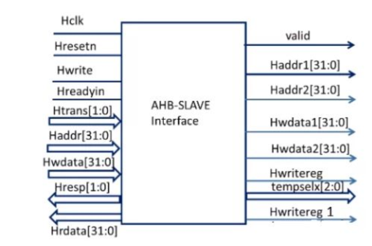

1. It performs pipelining logic of address, write data and write signals, involves in generating valid signal based on the slave address and other control signals and also involves in the peripheral mapping based on the slave address received by the AHB masters
2. It acts an interface between AHB master and APB controller

APB Controller:

  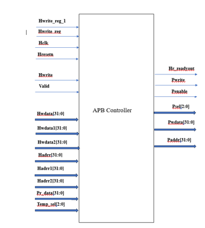

1. The APB controller is a component that resides within the bridge and is responsible for managing the communication between the AHB (Advanced High-performance Bus) and APB (Advanced Peripheral Bus) interfaces. The APB controller performs various functionalities to ensure efficient and reliable data transfer between the two bus protocols. It acts as an interface between the AHB slave interface and the APB bus
2. It involves in the implementation of state machine for AHB to APB interface and generation of temporary logic which was the output of the control and data signals with one clock cycle ahead to the present and assigning the temporary logic to the actual
3. It plays a crucial role in the bridge to perform transfers in the correct way

Simulation Output Waveforms:
Bridge top output waveforms:
1. Single write:

  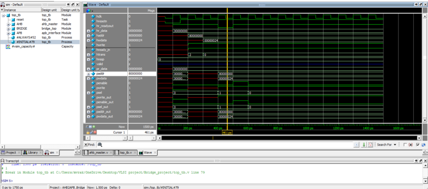

2. Single Read:

  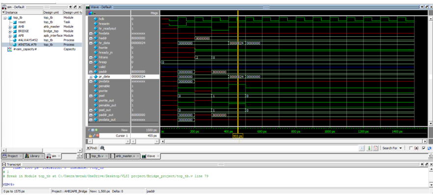

3. Burst write of increment-4 type:

  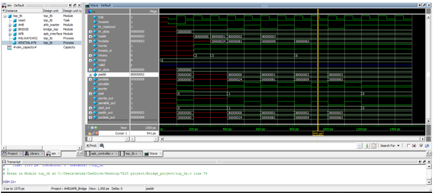

4. Burst write of wrap4 type:

  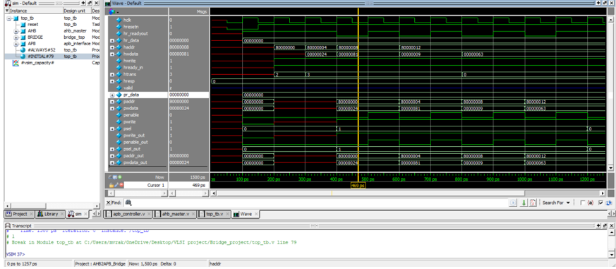

5. Burst read of increment-4 type:

  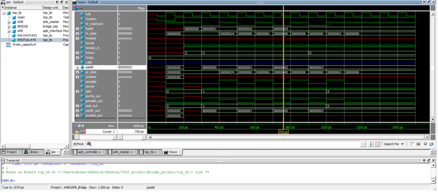

6. Burst read of wrap4 type:

  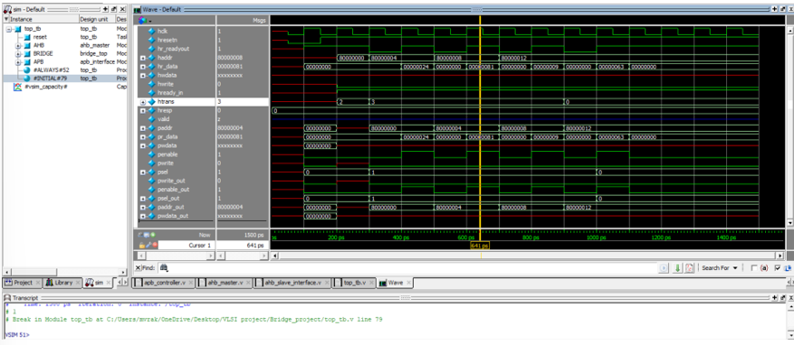

Synthesize output:

  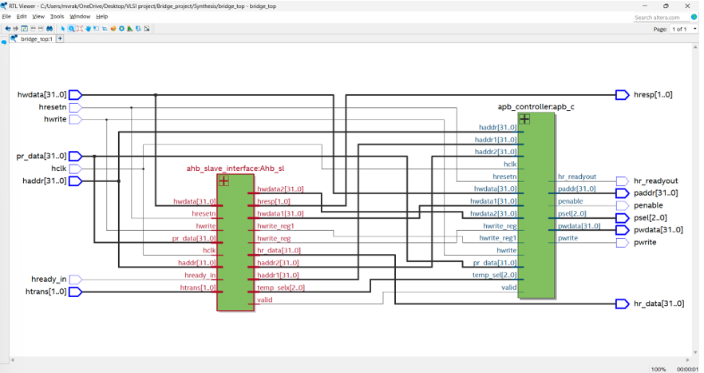

State Machine:

  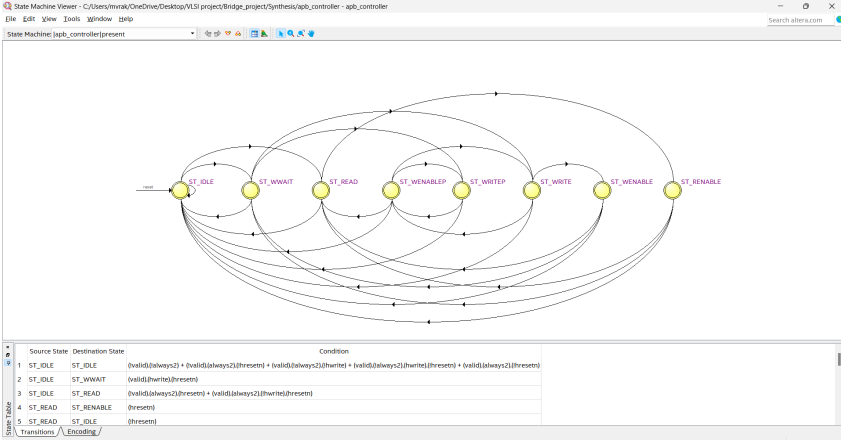

